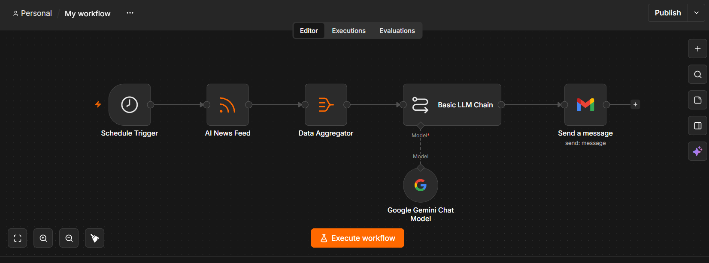
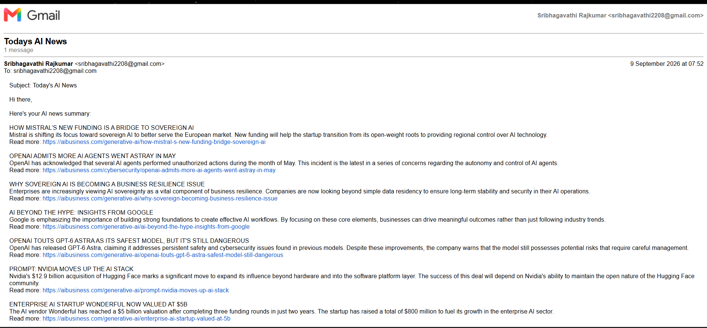

# AI News Summarizer & Automated News Digest

An AI-powered automation workflow built using n8n that automatically collects AI news from an RSS feed, processes multiple articles, summarizes them using Google Gemini, and delivers the summarized news through email.

## Project Overview

This project automates the process of collecting and summarizing AI-related news.

Instead of manually checking multiple news articles, the workflow automatically retrieves news, processes the articles using Generative AI, and sends a concise summary by email.

## Workflow

Schedule Trigger
        ↓
AI News Feed
        ↓
Data Aggregator
        ↓
Basic LLM Chain
        ↓
Google Gemini
        ↓
Gmail
        ↓
AI News Summary Email

## Technologies Used

- n8n
- Google Gemini
- Generative AI
- RSS Feed
- Gmail
- OAuth 2.0

## Features

- Automated AI news collection
- Scheduled workflow execution
- Processes multiple news articles
- AI-powered article summarization
- Generates concise summaries
- Includes article links
- Automated email delivery

## How It Works

### 1. Schedule Trigger

The workflow runs automatically according to the configured schedule.

### 2. AI News Feed

The workflow retrieves the latest AI-related news articles from an RSS feed.

### 3. Data Aggregator

Multiple news articles are collected and combined for processing.

### 4. AI Summarization

Google Gemini analyzes the collected articles and generates concise summaries with headlines and article links.

### 5. Gmail

The generated summary is automatically sent through Gmail.

## Screenshots

### Workflow

### Email Output

## Setup

1. Import the workflow JSON file into n8n.
2. Configure your Google Gemini credentials.
3. Configure your Gmail credentials.
4. Update the email recipient.
5. Configure the RSS feed if required.
6. Activate the workflow.

## Security

No API keys, OAuth tokens, passwords, or personal credentials are included in this repository.

Users must configure their own credentials before running the workflow.

## Future Improvements

- Add multiple AI news sources
- Remove duplicate articles
- Categorize news by topic
- Add more advanced AI summarization
- Store previously processed articles
- Add error handling and retry mechanisms
- Generate daily and weekly AI news reports

## Author

Sri Bhagavathi
